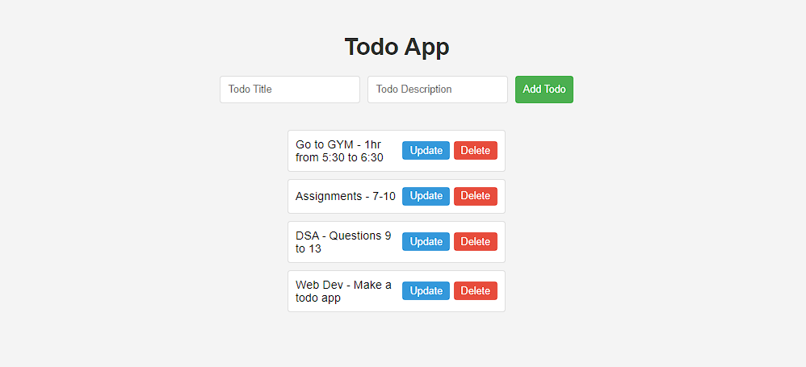

# Todo App

A simple and organized Todo App with a Node.js backend and a beautiful frontend.

## Table of Contents

- [Overview](#overview)
- [Features](#features)
- [Prerequisites](#prerequisites)
- [Getting Started](#getting-started)
  - [Installation](#installation)
  - [Usage](#usage)
- [API Endpoints](#api-endpoints)
- [Frontend](#frontend)
- [Tech Stack](#tech-stack)
- [Contributing](#contributing)
- [License](#license)

## Overview

This Todo App is designed to help you keep track of your tasks with ease. It features a Node.js backend that handles the logic of the todo list and a clean, attractive frontend for a seamless user experience.

## Features

- Create, read, update, and delete todos.
- Store todo data in-memory without the need for a database.
- Persistent data storage using JSON files.
- Beautiful and responsive user interface.

## Prerequisites

Before you begin, ensure you have the following installed:

- Node.js
- npm (Node Package Manager)

## Getting Started

### Installation

1. Clone the repository:

   ```bash
   git clone https://github.com/your-username/your-repo.git
   ```

2. Navigate to the project directory:

   ```bash
   cd your-repo
   ```

3. Install dependencies:

   ```bash
   npm install
   ```

### Usage

1. Run the server:

   ```bash
   npm start
   ```

   This will start the Node.js server at `http://localhost:3000`.

2. Open the frontend:

   Open `index.html` in your browser or serve it using a simple HTTP server.

   ```bash
   # For example, using Python:
   python -m http.server
   ```

   Open your browser and go to `http://localhost:8000` (or another port as specified by the server).

## API Endpoints

- **GET /todos**: Retrieve all todo items.
- **GET /todos/:id**: Retrieve a specific todo item by ID.
- **POST /todos**: Create a new todo item.
- **PUT /todos/:id**: Update an existing todo item by ID.
- **DELETE /todos/:id**: Delete a todo item by ID.

For more details, refer to the [API Documentation](#).

## Frontend

The frontend is a simple and elegant user interface for managing your todos. It provides a form to add new todos, a list to display existing todos, and buttons to update or delete todos.



## Tech Stack

- Node.js
- Express
- HTML
- CSS
- JavaScript

## Contributing

Contributions are welcome! Feel free to open an issue or submit a pull request.
